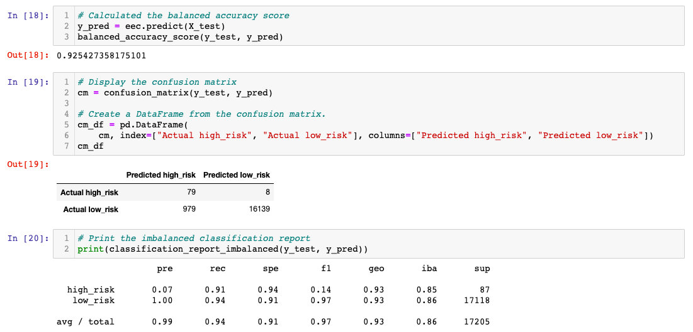
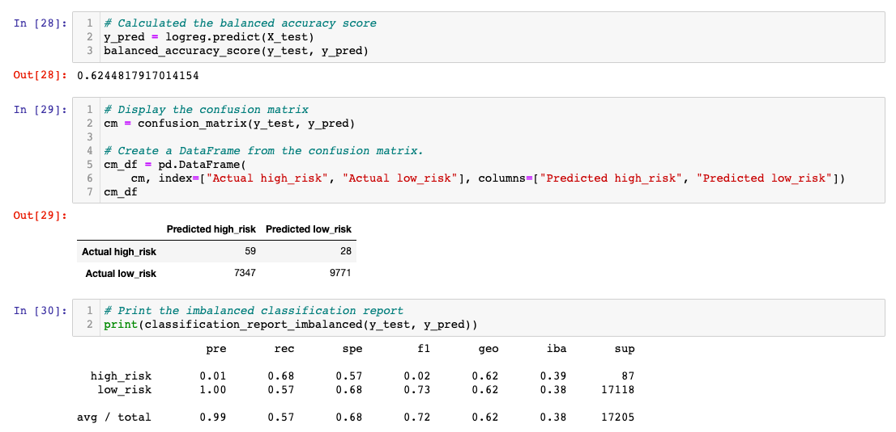
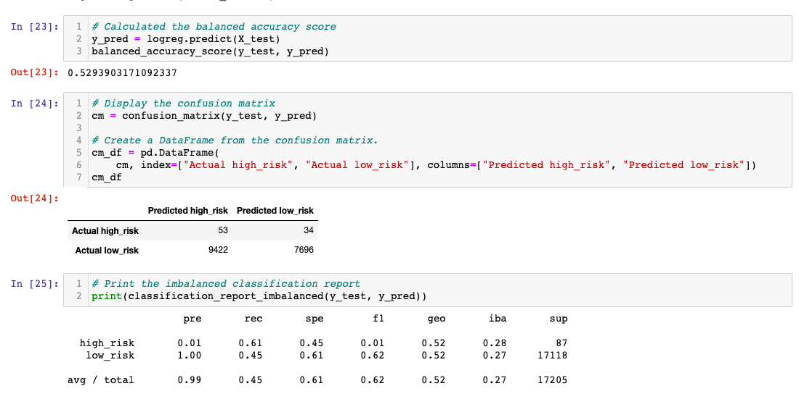
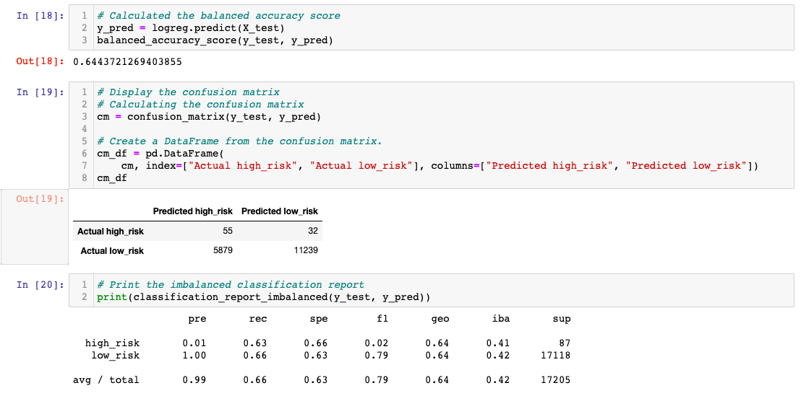
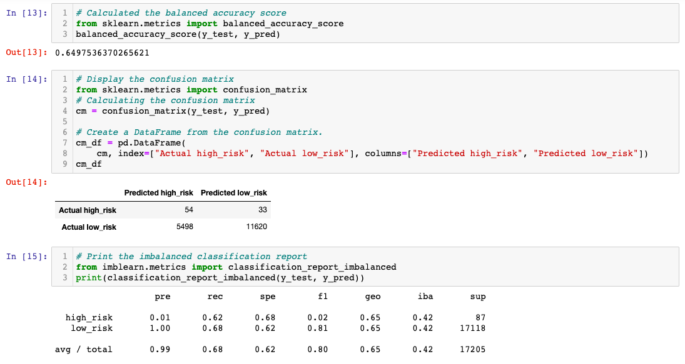

# Credit_Risk_Analysis

## Overview of the Analysis
Jill commends you for all your hard work. Piece by piece, you’ve been building up your skills in data preparation, statistical reasoning, and machine learning. You are now ready to apply machine learning to solve a real-world challenge: credit card risk.

## Results: 

### RandomOverSampler Model

### SMOTE Model

### ClusterCentroids Model

### SMOTEENN Model

### BalancedRandomForestClassifier Model

### EasyEnsembleClassifier Model

## Summary 

